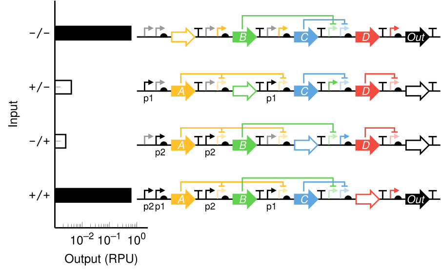

# Description

This is a LaTeX package for drawing genetic construct pictograms using
[Ti*k*Z](https://www.ctan.org/pkg/pgf). **Under development, there are
no reusable macros at the moment.**

We provide a Ti*k*Z library called `dna` that installs one core macro,
`\dnaplot`.
```latex
\usetikzlibrary{dna}
\begin{tikzpicture}
  \node (dox) at (0,1) {dox};
  \dnaplot [] features {promoter        [name=p1],
                        coding sequence [name=gA],
                        terminator,
                        promoter        [name=p2],
                        coding sequence [name=gB],
                        terminator};
  \dnaplot [] regulation {dox -| {gB -| p1, gA -| p2}};
\end{tikzpicture}
```

# Gallery



Compare this image with [this gallery entry](https://github.com/VoigtLab/dnaplotlib/tree/master/gallery/xnor_truthtable)
from dnaplotlib. The image above was drawn entirely in Ti*k*Z, the source
is in [example.tex](example.tex).

# License

This package is under development and provided under the LaTeX Project
Public License version 1.3c. A copy of the license can be found in `LICENSE`.

Certain components of this package were built by reverse-engineering the
Ti*k*Z `graphs` and `shapes.arrows` libraries. Under the terms of the Ti*k*Z
license (the LaTeX Project Public License version 1.3c), these reverse-engineered
components can be considered Derived Works not intended as replacements
of the original Work. Ti*k*Z was created by Till Tantau and is available
at <https://www.ctan.org/pkg/pgf>.
