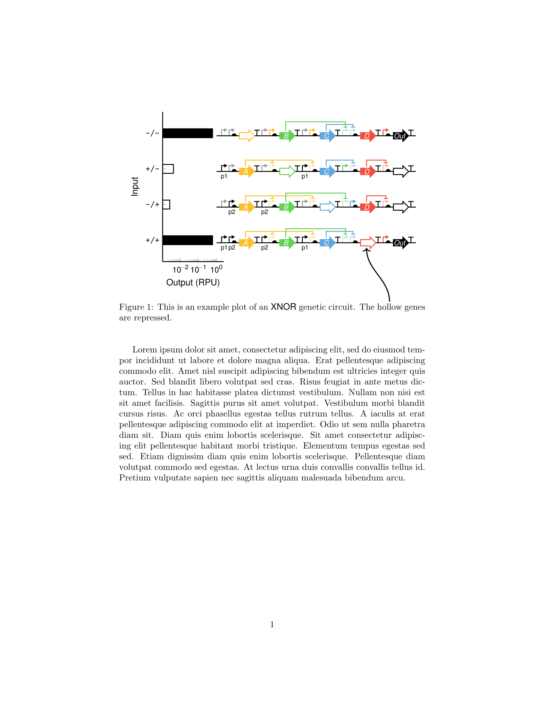

# Description

This is a LaTeX package for drawing genetic construct pictograms using
[Ti*k*Z](https://www.ctan.org/pkg/pgf). **Under development, there are
no reusable macros at the moment.**

We provide a Ti*k*Z library called `dna` that installs one core macro,
`\dnaplot`.
```latex
\usetikzlibrary{dna}
\begin{tikzpicture}
  \dnaplot [] features {promoter [name=p1], coding sequence [name=gA], terminator, promoter [name=p2], coding sequence [name=gB], terminator};
  \dnaplot [] regulation {gB -> p1 [anchor=120], gA -> p2};
\end{tikzpicture}
```

# Gallery



Compare this image with [this gallery entry](https://github.com/VoigtLab/dnaplotlib/tree/master/gallery/xnor_truthtable)
from dnaplotlib. The image above was drawn entirely in Ti*k*Z.

# License

This package is under development and provided under the LaTeX Project
Public License version 1.3c. A copy of the license can be found in `LICENSE`.

Part of this package (the contents of the `shorthand/` folder) was built
by reverse-engineering tikz-timing, a package by Martin Sharrer for drawing
timing diagrams of clocked electrical circuits with Ti*k*Z. Under the terms
of the LaTeX Project Public License version 1.3c, the licence under which
tikz-timing is released, tikz-dna is considered a Derived Work that is
not intended as a replacement of the original Work (tikz-timing). You can
obtain tikz-timing on CTAN at <https://ctan.org/pkg/tikz-timing>. Thanks
to Martin Scharrer for tikz-timing and his numerous contributions to the
LaTeX community.

Parts of the `shapes.dna` library are modified versions (not replacements)
of shapes provided in Ti*k*Z by Till Tantau. Ti*k*Z is available at <https://www.ctan.org/pkg/pgf>.

The `dna` library copies a portion parsing mechanism of PGFPlots by Christian
Feuersänger. PGFPlots is available at <https://ctan.org/pkg/pgfplots>.
